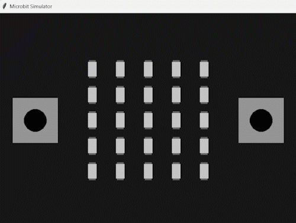

# Microbit Python Simulator

Microbit Python Simulator is a simulator for the microbit written in python. It provides a simple interface to interact the microbit programs without the need to flash a microbit.

- **Documentation:** https://microbit-micropython.readthedocs.io/en/v1.1.1/index.html
- **Downloads page:** https://github.com/BergLucas/microbit-python-simulator/releases

<p align="center">
    
</p>

## Features

- [x] radio
- [x] Image
- [x] display
- [x] buttons
- [x] accelerometer
- [x] sleep
- [x] running_time
- [x] reset
- [x] panic
- [x] temperature
- [ ] pins
- [ ] compass
- [ ] i2c
- [ ] uart
- [ ] spi

## Notes

There may be bugs or differences with the real microbit. Feel free to report them in the [issues section](https://github.com/BergLucas/microbit-python-simulator/issues).

## Requirements

The application requires:

- [Python](https://www.python.org/) ~= 3.9
- [pip](https://pip.pypa.io/en/stable/)

## Download & Installation

There is only one way to download and install the application at the moment:

```bash
pip install git+https://github.com/BergLucas/microbit-python-simulator
```

## Example

This example allows you to display `"Hello, World!"` on the microbit:

```python
import microbit

microbit.display.scroll("Hello, World!")
```

## License

All code is licensed for others under a MIT license (see [LICENSE](https://github.com/BergLucas/microbit-python-simulator/blob/main/LICENSE)).
